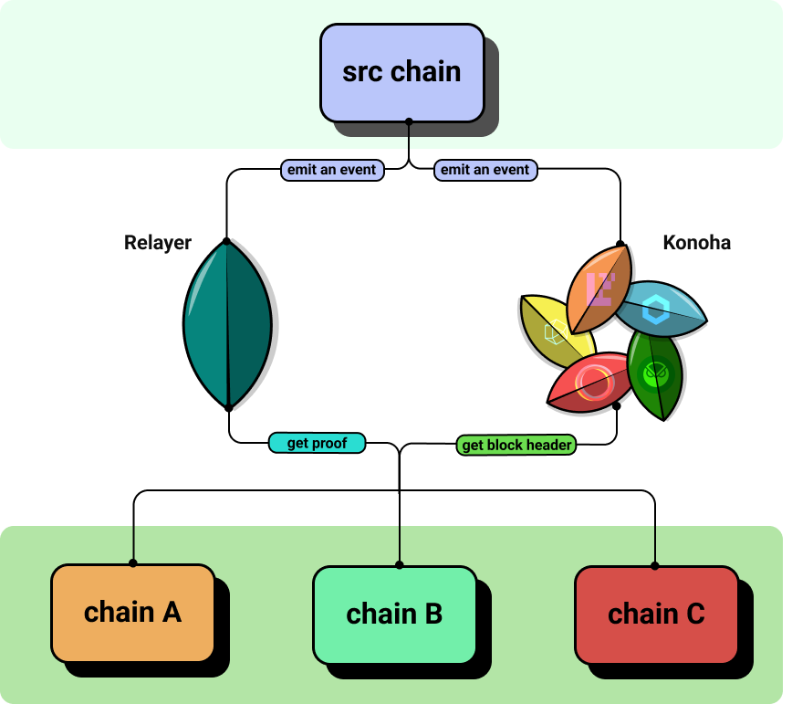
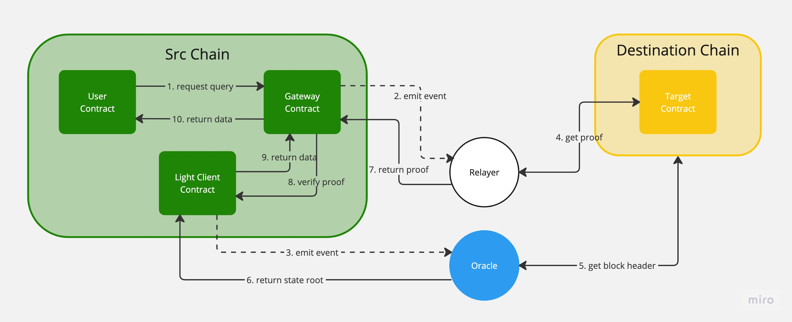

# Architecture

### High-level Architecture

<figure><figcaption>
High-level Architecture
</figcaption></figure>

In Futaba, [Relayer](../protocol/relayer.md) and [Konoha (Oracle)](../protocol/oracle.md) are the off-chain components and they receive the Src (source) chain requests. Relayer then retrieves the storage proof from each chain, and Konoha retrieves the block headers and returns them to the Src chain for validation.

### Detailed Architecture

<figure><figcaption>
Detailed architecture
</figcaption></figure>

**Phase1: request query**

1. Call the endpoint to request a Gateway Contract query from the user contract
2. Gateway Contract emits events related to query requests to Relayer
3. An event about the query of the block header is emitted from Light Client Contract to Oracle

**Phase2: off-chain agents work**

* Oracle work
  1. Oracle receives the event and gets the block header (state root) for a specific block height in the destination chain
  2. Return and save state root to Light Client Contract
* Relayer work
  1. Relayer receives the event and obtains the account proof and storage proof of the target data
  2. Return the proof to the Gateway Contract in the src chain (at this time, the state root must have been saved first)

**Phase3: verify and return data to the user**

1. Light Client Contract to verify account proof and storage proof
2. The store received data as a cache
3. If verification is successful, data is returned to User Contract
