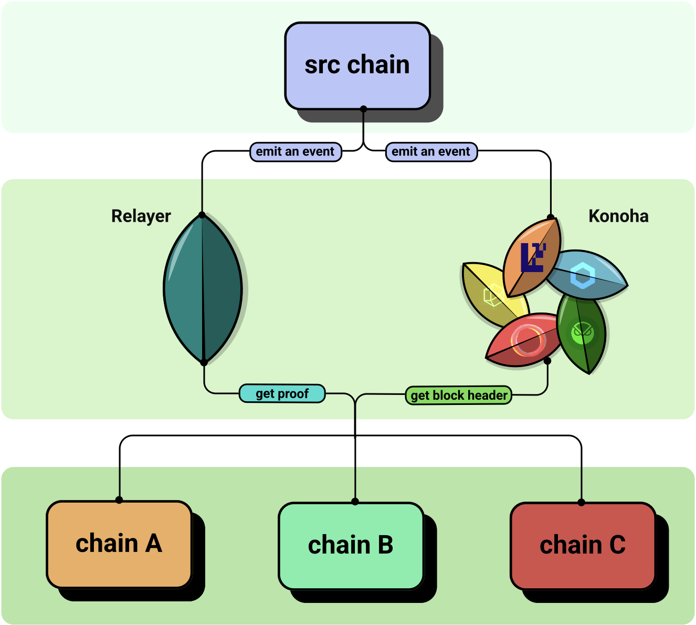

# Architecture

### High-level Architecture

<figure><figcaption>
High-level Architecture
</figcaption></figure>

In Futaba, [Relayer](../protocol/relayer.md) and [Konoha (Oracle)](../protocol/konoha/) are the off-chain components and they receive the Src (Source) chain requests. Relayer then retrieves the storage proof from each chain, and [Konoha](https://app.gitbook.com/o/Thz2mfuoktjdE6MeG8yW/s/sOs4pzHyvFKixViaeh5C/\~/changes/26/protocol/konoha) retrieves the block headers and returns them to the Src chain for validation.

### Detailed Architecture

<figure><figcaption>
Detailed architecture
</figcaption></figure>

**Phase 1: request query**

1. Call the endpoint to request a [Gateway Contract](../protocol/gateway/) query from the user contract
2. [Gateway Contract](../protocol/gateway/) emits events related to query requests to [Relayer](../protocol/relayer.md)
3. An event about the query of the block header is emitted from [Light Client Contract](../protocol/light-client/) to [Konoha (Oracle)](https://app.gitbook.com/o/Thz2mfuoktjdE6MeG8yW/s/sOs4pzHyvFKixViaeh5C/\~/changes/26/protocol/konoha)

**Phase 2: off-chain agents work**

* [Konoha](../protocol/konoha/)
  1. [Konoha](../protocol/konoha/) receives the event and gets the block header (state root) for a specific block height in the destination chain
  2. Return and save state root to [Light Client Contract](../protocol/light-client/)
* [Relayer](../protocol/relayer.md) work
  1. [Relayer](../protocol/relayer.md) receives the event and obtains the account proof and storage proof of the target data
  2. Return the proof to the [Gateway Contract](../protocol/gateway/) in the src chain (at this time, the state root must have been saved first)

**Phase 3: verify and return data to the user**

1. [Light Client Contract](../protocol/light-client/) to verify account proof and storage proof
2. The store received data as a cache
3. If verification is successful, data is returned to User Contract
