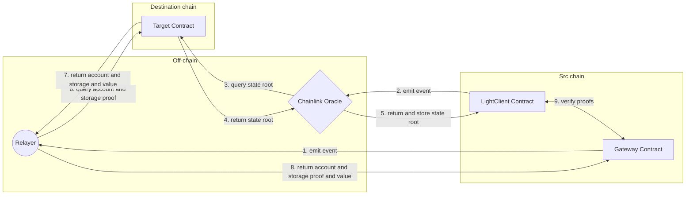

# Chainlink Oracle

Chainlink Oracle is currently used as the default module for providing block headers in Futaba. Specifically, it requests a job that can be configured in the Chainlink Node to execute an API to retrieve block headers configured as an External Adapter and return them to the contract.



In the case of Chainlink, the state root is directly obtained and stored, not the block header.
