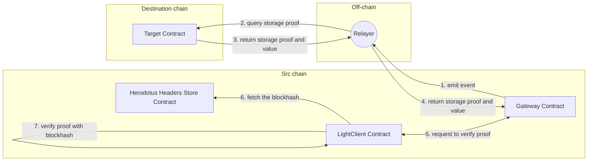

# Herodotus

Herodotus is a powerful data access middleware that provides smart contracts with synchronous access to current and historical on-chain data across Ethereum layers.&#x20;

Futaba can use this Herodotus as an Oracle to access Ethereum's historical block headers in a trustless manner.



In the traditional Futaba setup, block headers are obtained using off-chain Oracle. However, when using Herodotus, header information is stored in the Headers Store Contract, allowing synchronous access during verification.

However, if the target block header doesn't exist, consideration is needed on whether to wait for the header update or adopt an alternative approach.

Herodotus is only intended for historical data, so for more recent data, another Oracle is more suitable.
