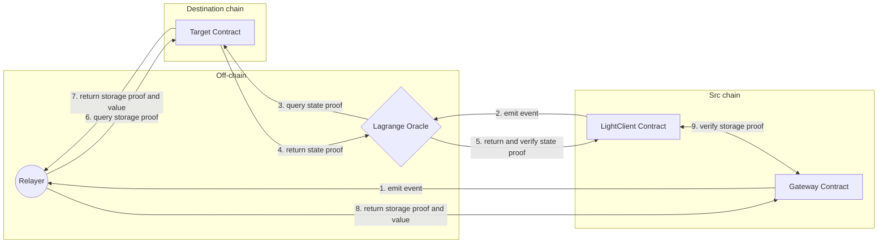

# Lagrange

The Lagrange Protocol is a cross-chain infrastructure that enables the creation of generalized state proofs across all major blockchains.

Applications that integrate with the Lagrange Protocol can enable applications to submit aggregated proofs of multi-chain states that can be verified in a non-interactive fashion by contracts on other chains.&#x20;

Futaba can use this Lagrange as an Oracle to get the state root of various chains/rollups in a trustless manner.



The event received from the [LightClient](../light-client/) contract is used by the Lagrange-based Oracle to obtain the state proof of the Destination chain and return it to the [LightClient](../light-client/) contract, which stores the state root after successful verification and uses it to verify the account proof and storage proof received from the [Relayer](../relayer.md).
